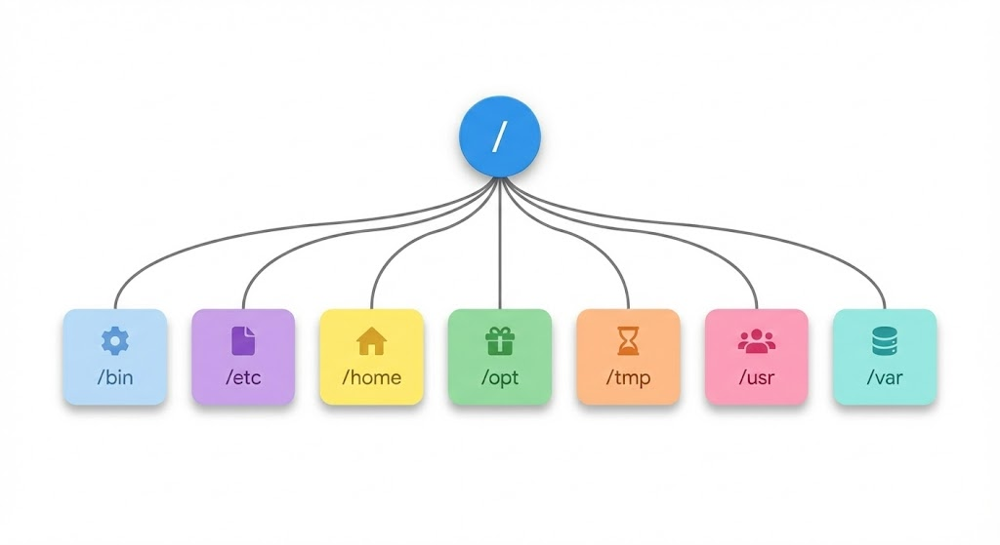

# 리눅스

## 리눅스의 중요성

대부분의 생명정보학 도구는 리눅스용으로 출시된다. 따라서 의생명정보학 연구를 위해서는 리눅스 환경에서의 작업이 필수적이다. 이는 리눅스 환경이 고성능 컴퓨팅과 대용량 데이터 처리에 최적화되어 있기 때문이며, 주로 다음과 같은 이유로 생명정보학 분야에서 널리 사용된다:

1. 다양한 오픈소스 도구의 가용성
2. 명령줄 인터페이스를 통한 효율적인 데이터 처리
3. 분산 컴퓨팅 환경과의 호환성
4. 배치 처리를 통한 대규모 분석 자동화 가능성

생명정보학을 공부하고 실무에 적용하기 위해서는 리눅스를 공부하는 것이 매우 중요하다.

## 리눅스의 역사와 철학

### 자유 소프트웨어 재단 (Free Software Foundation, FSF)

자유 소프트웨어 재단은 1985년 리처드 스톨만(Richard Stallman, 일명 "RMS")에 의해 창설되었다. 이 재단의 핵심 철학은 "자유(Free) 소프트웨어"의 개념이다. 여기서 말하는 "자유"란 누구나 자유롭게 소프트웨어를 공부하고, 변경하고, 배포할 수 있도록 그 소스 코드가 공개된 소프트웨어를 의미한다. 

이는 소프트웨어를 무료로 제공해야 한다는 의미가 아니다. 리처드 스톨만의 유명한 말에 따르면 "자유 소프트웨어는 언론의 자유와 같은 자유를 의미하는 것이지, 무료 맥주를 의미하는 것이 아니다(Free in the sense of free speech, not free beer)."

자유 소프트웨어 재단은 일반 공중 사용 허가서(General Public License, GPL)를 통해 자유 소프트웨어의 권리를 보호한다. GPL은 자유 소프트웨어를 사용하여 개발한 소프트웨어도 반드시 자유 소프트웨어가 되어야 한다는 조건을 포함한다.

### GNU 프로젝트

GNU(GNU is not UNIX!)는 자유 소프트웨어 재단의 주요 프로젝트 중 하나이다. 이 프로젝트의 목표는 당시 가장 인기 있었던 운영체제인 유닉스(UNIX)의 "클론"을 제작하는 것이었다. 유닉스는 커널(Kernel)과 다양한 유틸리티로 구성되어 있었다.

리처드 스톨만은 이를 위해 수많은 유틸리티를 개발했다:
- Emacs (텍스트 에디터)
- GCC (GNU Compiler Collection, C 컴파일러)
- GDB (디버거)
- GNU make (빌드 자동화 도구)
등 다양한 도구들이 개발되었다.

### 리눅스 커널의 탄생

한편, 지구 반대편 핀란드에서는 리누스 토발즈(Linus Torvalds)가 "재미로(just for fun)" 운영체제 커널을 개발하고 있었다. 이 커널은 후에 GNU 프로젝트의 일부로 편입되게 된다.


**Figure 18.1** 리누스 토발즈가 리눅스를 처음 발표한 역사적 순간 (1991년)

### GNU/Linux 시스템

GNU 프로젝트의 유틸리티와 리눅스 커널의 결합으로 GNU/Linux 시스템이 탄생했다. 이 시스템은 유닉스와 완전히 호환되는 POSIX 준수 시스템으로, 현재 99% 이상의 서버 시스템이 리눅스를 채택하고 있다.

현재는 이 시스템을 간단히 "리눅스"라고 부르는 것이 일반적이다. 이는 시스템에 포함된 모든 소프트웨어가 GPL을 따르는 것은 아니기 때문이다. 물론 리처드 스톨만은 리눅스라는 명칭보다는 GNU/Linux라는 명칭을 선호한다.

## 리눅스 배포판

### 배포판의 개념

리눅스 배포판은 각자의 취향과 목적에 맞는 소프트웨어를 기본으로 포함하는 리눅스 운영체제이다. 다양한 배포판이 존재하며, 이들은 웹사이트 https://distrowatch.com/ 에서 확인할 수 있다.

### 주요 배포판

가장 널리 사용되는 두 카테고리의 배포판은 다음과 같다:
- 데비안 계열: 우분투 리눅스(Ubuntu Linux)가 대표적이다.
- 레드햇 계열: CentOS가 대표적이다.

### 패키지 매니저

배포판의 주요 차이점 중 하나는 패키지 매니저이다:
- 데비안 계열: APT (Advanced Package Tool)
- 레드햇 계열: YUM (Yellowdog Updater Modified), 최근에는 DNF (Dandified YUM)

이들은 비슷한 활용법을 가지고 있다:
- `apt install 패키지명` (데비안 계열)
- `yum install 패키지명` 또는 `dnf install 패키지명` (레드햇 계열)

패키지 매니저는 "루트(root)" 권한이 있는 사용자만 활용할 수 있다.

## 리눅스 기본 개념

### 루트 (Root)

리눅스에서 "루트"는 두 가지 의미를 가진다:
1. 시스템 관리자 (슈퍼유저)
2. 디렉토리 구조에서 가장 첫 번째 노드 (/)

### 디렉토리

디렉토리는 파일 및 다른 디렉토리를 포함할 수 있는 논리적 공간을 의미한다. 윈도우의 "폴더"와 같은 개념이다.



**Figure 18.2** 리눅스 파일 시스템의 경로 구조와 절대경로/상대경로

### 주요 디렉토리 구조

리눅스의 주요 디렉토리는 다음과 같다:

- **/bin**: 기본 실행 파일들이 저장된다. ls, cp, mv 등의 명령어가 이 디렉토리에 있다.
- **/home**: 사용자들의 홈 디렉토리가 저장된다. 각 사용자는 /home/사용자명 형태의 개인 공간을 가진다.
- **/opt**: 추가적인 소프트웨어 패키지가 설치된다.
- **/tmp**: 임시 파일이 저장되는 공간이다. 시스템 재부팅 시 삭제될 수 있다.
- **/usr**: 사용자 프로그램과 데이터가 저장된다. /usr/bin, /usr/lib 등의 하위 디렉토리를 포함한다.
- **/var**: 가변 데이터 파일이 저장된다. 로그 파일, 데이터베이스 등이 여기에 위치한다.
- **/etc**: 시스템 설정 파일이 저장된다.

### 쉘 (Shell)

쉘은 커널과 사용자 간의 인터페이스 역할을 한다. 주로 CUI(Command-Line User Interface) 기반으로, 키보드를 통해 명령어를 입력하고 화면에 그 결과를 확인할 수 있다.

주요 쉘의 종류:
- sh: Bourne shell (UNIX 표준 쉘)
- bash: GNU Bourne-Again Shell (GNU 프로젝트 표준 쉘)
- csh, zsh, fish 등: 편의기능이 추가된 쉘

## 가상 환경 구축

프로젝트별로 분리된 가상 환경을 구축하면 서로 다른 프로젝트에서 서로 다른 버전의 소프트웨어를 사용할 수 있다. 생명정보학에서는 주로 두 가지 도구를 상호 보완적으로 사용한다:

- **Micromamba**: 소프트웨어 관리 (R, samtools 등 비Python 도구 설치)
- **uv**: Python 패키지 관리

최근에는 Python 패키지 관리에 Conda를 사용하지 않는 추세이다. Python 패키지는 uv로 관리하고, R이나 기타 생명정보학 소프트웨어는 Micromamba로 관리하는 것이 효율적이다.

### Micromamba: 소프트웨어 관리

Micromamba는 Conda의 빠른 대안으로, R이나 생명정보학 도구를 설치하는 데 적합하다.

#### Micromamba 설치

```bash
$ curl -Ls https://micro.mamba.pm/api/micromamba/linux-64/latest | tar -xvj bin/micromamba
$ ./bin/micromamba shell init -s bash -p ~/micromamba
$ source ~/.bashrc
```

#### Micromamba 사용 예제

```bash
# R 환경 생성 및 R 설치
$ micromamba create -n r-env r-base r-tidyverse
$ micromamba activate r-env
(r-env) $ R --version
R version 4.x.x

# 생명정보학 도구 설치
$ micromamba create -n bioinfo samtools bwa bedtools
$ micromamba activate bioinfo
(bioinfo) $ samtools --version

# 환경 비활성화
(bioinfo) $ micromamba deactivate

# 설치된 환경 목록 확인
$ micromamba env list
```

### uv: Python 패키지 관리

uv는 Rust로 작성된 빠르고 현대적인 Python 패키지 매니저이다. 기존의 pip, conda보다 훨씬 빠른 속도를 제공한다.

#### uv 설치

```bash
$ curl -LsSf https://astral.sh/uv/install.sh | sh
```

#### uv 기본 사용법

uv는 `uv run` 명령어를 통해 가상환경을 명시적으로 활성화하지 않고도 Python 스크립트를 실행할 수 있다.

```bash
# 프로젝트 디렉토리 생성
$ mkdir project1
$ cd project1

# 가상환경 생성
$ uv venv

# 패키지 설치
$ uv pip install numpy pandas matplotlib

# Python 스크립트 실행 (가상환경 자동 사용)
$ uv run python script.py

# Python 버전 확인
$ uv run python --version

# 패키지 버전 확인
$ uv run python -c "import numpy; print(numpy.__version__)"
```

#### 가상환경 생성 예제

다음은 두 가지 프로젝트에서 서로 다른 버전의 Python을 사용하는 예제이다:

```bash
# project1 환경 생성 (Python 3.9)
$ mkdir project1 && cd project1
$ uv venv --python 3.9
$ uv run python --version
Python 3.9.x

# 필요한 패키지 설치
$ uv pip install numpy pandas matplotlib
$ uv run python -c "import numpy; print(numpy.__version__)"
1.xx.x

# project2 환경 생성 (Python 3.13)
$ mkdir ../project2 && cd ../project2
$ uv venv --python 3.13
$ uv run python --version
Python 3.13.x

# 필요한 패키지 설치 (동일한 패키지, 다른 버전)
$ uv pip install numpy pandas matplotlib
$ uv run python -c "import numpy; print(numpy.__version__)"
2.xx.x
```

### Micromamba와 uv의 상호 보완적 사용

두 도구는 각자의 강점이 있으므로 함께 사용하는 것이 효과적이다:

- **Micromamba 사용**: R, samtools, bwa, bedtools 등 비Python 소프트웨어 설치
- **uv 사용**: numpy, pandas, biopython 등 Python 패키지 관리

예를 들어, R과 Python을 함께 사용하는 프로젝트에서는 Micromamba로 R을 설치하고, uv로 Python 패키지를 관리할 수 있다.

## 생명정보학 문제 해결: Rosalind

Rosalind는 생명정보학 문제풀이 웹사이트(https://rosalind.info/)로, 생명정보학을 코딩테스트처럼 공부할 수 있게 해준다. 생명정보학 개념을 실습을 통해 배우고 싶다면 Rosalind의 문제를 풀어보는 것이 좋은 방법이다.

## 리눅스 필수 명령어

### 파일 시스템 탐색

- **pwd** (Print Working Directory): 현재 디렉토리 경로 확인
  - 경로가 /로 시작하는 경우 "절대경로", 그렇지 않은 경우 "상대경로"


**Figure 18.3** pwd 명령어를 통한 현재 작업 디렉토리 확인

- **cd** (Change Directory): 디렉토리 변경
  - 탭키를 활용하여 긴 경로를 쉽게 입력할 수 있다.
- **ls** (List): 디렉토리 내용 표시

### 파일 및 디렉토리 관리

- **chmod** (Change Mode): 파일/디렉토리 권한 변경
- **groups**: 현재 내가 소속된 그룹 확인
- **cp** (Copy): 파일/디렉토리 복사
  - 디렉토리 복사 시에는 -r 옵션이 필요하다.
  - `cp 소스파일 {대상파일 또는 대상디렉토리}`
  - `cp -r 소스디렉토리 대상디렉토리`
- **mv** (Move): 파일/디렉토리 이동 또는 이름 변경
  - `mv 소스파일 {대상파일 또는 대상디렉토리}`
- **mkdir** (Make Directory): 디렉토리 생성
  - `mkdir 디렉토리명`
- **rmdir** (Remove Directory): 디렉토리 삭제 (비어있는 디렉토리만 삭제 가능)
  - `rmdir 디렉토리명`
- **rm** (Remove): 파일/디렉토리 삭제
  - 디렉토리 삭제를 위해서는 -r 옵션을 사용해야 한다.
  - `rm 파일명`
  - `rm -r 디렉토리명`
  - 한번 삭제된 파일은 복구할 수 없으므로 신중히 사용해야 한다.

### 시스템 모니터링

- **htop**: 현재 실행 중인 프로세스 확인


**Figure 18.4** htop을 이용한 시스템 리소스 모니터링

### 파일 조작

- **cat / less**: 파일 내용 확인
- **zcat / zless**: gz 압축된 파일 내용 확인
- **nano**: 간단한 텍스트 편집기


**Figure 18.5** nano 텍스트 에디터의 인터페이스와 기본 사용법

- **wget**: 인터넷에서 파일 다운로드
- **ln -s**: 심볼릭 링크 생성
  - `ln -s 원본파일 링크파일`
  - 심볼릭 링크는 원본 파일을 가리키는 바로가기와 같다.

## 표준 입출력과 리다이렉션

리눅스에서는 프로그램의 입출력을 다른 파일이나 프로그램으로 연결할 수 있다. 이를 리다이렉션(Redirection)이라고 한다.

### 표준 스트림

리눅스의 모든 프로세스는 세 가지 표준 스트림을 가진다:

- **stdin (표준 입력, 파일 디스크립터 0)**: 키보드로부터의 입력
- **stdout (표준 출력, 파일 디스크립터 1)**: 화면으로의 일반 출력
- **stderr (표준 에러, 파일 디스크립터 2)**: 화면으로의 에러 메시지 출력

### 리다이렉션 연산자

```bash
# 표준 출력을 파일로 저장 (덮어쓰기)
$ ls > file_list.txt

# 표준 출력을 파일로 저장 (추가)
$ ls >> file_list.txt

# 표준 에러를 파일로 저장
$ command 2> error.log

# 표준 출력과 표준 에러를 모두 파일로 저장
$ command > output.txt 2>&1
# 또는
$ command &> output.txt

# 파일 내용을 표준 입력으로 사용
$ sort < unsorted.txt
```

### 파이프 (Pipe)

파이프(`|`)는 한 명령어의 출력을 다른 명령어의 입력으로 연결한다:

```bash
# ls 출력을 grep으로 필터링
$ ls -la | grep ".txt"

# 파일 내용을 정렬하고 중복 제거
$ cat data.txt | sort | uniq

# 단어 개수 세기
$ cat document.txt | wc -w

# 여러 파이프 연결
$ zcat large_file.gz | grep "pattern" | sort | uniq -c | head -10
```

### 프로세스 치환 (Process Substitution)

프로세스 치환 `<()`는 명령어의 출력을 임시 파일처럼 사용할 수 있게 한다:

```bash
# 두 명령어의 출력을 비교
$ diff <(sort file1.txt) <(sort file2.txt)

# 두 디렉토리의 파일 목록 비교
$ diff <(ls dir1) <(ls dir2)
```

## grep과 정규표현식

### grep 명령어

grep은 파일에서 특정 패턴을 검색하는 명령어이다:

```bash
# 기본 사용법
$ grep "pattern" filename

# 대소문자 무시
$ grep -i "pattern" filename

# 줄 번호 표시
$ grep -n "pattern" filename

# 패턴이 없는 줄 출력
$ grep -v "pattern" filename

# 재귀적으로 디렉토리 내 모든 파일 검색
$ grep -r "pattern" directory/

# 일치하는 파일명만 출력
$ grep -l "pattern" *.txt
```

### 정규표현식 (Regular Expression)

정규표현식은 문자열 패턴을 표현하는 방법이다:

- `.`: 임의의 한 문자
- `*`: 앞 문자가 0번 이상 반복
- `+`: 앞 문자가 1번 이상 반복
- `?`: 앞 문자가 0번 또는 1번
- `^`: 줄의 시작
- `$`: 줄의 끝
- `[abc]`: a, b, c 중 하나
- `[a-z]`: a부터 z까지 중 하나
- `[^abc]`: a, b, c가 아닌 문자
- `\d`: 숫자 (0-9)
- `\s`: 공백 문자
- `\w`: 단어 문자 (알파벳, 숫자, 밑줄)

```bash
# 확장 정규표현식 사용 (-E 옵션)
$ grep -E "^chr[0-9]+\s" genome.bed

# FASTA 파일에서 헤더 라인만 추출
$ grep "^>" sequences.fasta

# 특정 패턴으로 시작하는 줄 찾기
$ grep -E "^ATCG" dna_sequences.txt

# 이메일 패턴 찾기
$ grep -E "[a-zA-Z0-9._%+-]+@[a-zA-Z0-9.-]+\.[a-zA-Z]{2,}" contacts.txt
```

## 쉘 스크립트

쉘 스크립트는 여러 명령어를 파일에 저장하여 자동으로 실행할 수 있게 하는 프로그램이다.

### 기본 구조

```bash
#!/bin/bash
# 이것은 주석이다

echo "Hello, World!"
```

스크립트 파일의 첫 줄 `#!/bin/bash`는 셔뱅(shebang)이라고 하며, 이 스크립트를 실행할 인터프리터를 지정한다.

### 변수

```bash
# 변수 선언 (= 양쪽에 공백 없음)
name="Bioinformatics"
count=10

# 변수 사용
echo $name
echo "Count is: $count"

# 명령어 결과를 변수에 저장
current_dir=$(pwd)
file_count=$(ls | wc -l)
```

### 조건문 (if)

```bash
#!/bin/bash

file="data.txt"

if [ -f "$file" ]; then
    echo "파일이 존재한다."
elif [ -d "$file" ]; then
    echo "디렉토리이다."
else
    echo "파일이 존재하지 않는다."
fi
```

조건 테스트 연산자:
- `-f file`: 파일이 존재하고 일반 파일인지
- `-d dir`: 디렉토리가 존재하는지
- `-e path`: 경로가 존재하는지
- `-z string`: 문자열이 비어있는지
- `-n string`: 문자열이 비어있지 않은지
- `$a -eq $b`: 숫자가 같은지
- `$a -ne $b`: 숫자가 다른지
- `$a -lt $b`: a가 b보다 작은지
- `$a -gt $b`: a가 b보다 큰지

### 반복문 (for)

```bash
#!/bin/bash

# 리스트 순회
for fruit in apple banana cherry; do
    echo "Fruit: $fruit"
done

# 파일 순회
for file in *.fastq; do
    echo "Processing: $file"
    # 파일 처리 명령어
done

# 숫자 범위 순회
for i in {1..10}; do
    echo "Number: $i"
done

# C 스타일 for 루프
for ((i=0; i<5; i++)); do
    echo "Index: $i"
done
```

### 반복문 (while)

```bash
#!/bin/bash

# 카운터 사용
count=1
while [ $count -le 5 ]; do
    echo "Count: $count"
    ((count++))
done

# 파일을 줄 단위로 읽기
while read line; do
    echo "Line: $line"
done < input.txt
```

### 실전 예제: FASTQ 파일 처리

```bash
#!/bin/bash

# FASTQ 파일들을 순회하며 품질 분석
for fastq in *.fastq.gz; do
    echo "Analyzing: $fastq"

    # 읽기 수 계산
    read_count=$(zcat "$fastq" | wc -l)
    read_count=$((read_count / 4))

    echo "Total reads: $read_count"
done
```

## 생명정보학에서의 리눅스 활용

리눅스는 생명정보학에서 필수적인 도구이다. 대부분의 생명정보학 소프트웨어와 데이터베이스는 리눅스 환경에서 개발되고 운영된다. 또한, 대용량 데이터 처리, 병렬 컴퓨팅, 자동화된 워크플로우 구축 등 생명정보학 연구에 필요한 다양한 작업을 리눅스 환경에서 효율적으로 수행할 수 있다.

리눅스의 명령줄 인터페이스(CLI)는 반복적인 작업을 자동화하고, 복잡한 데이터 처리 파이프라인을 구축하는 데 유용하다. 또한, 서버 환경에서의 원격 작업 및 배치 작업 실행에도 리눅스의 기능이 필수적이다.